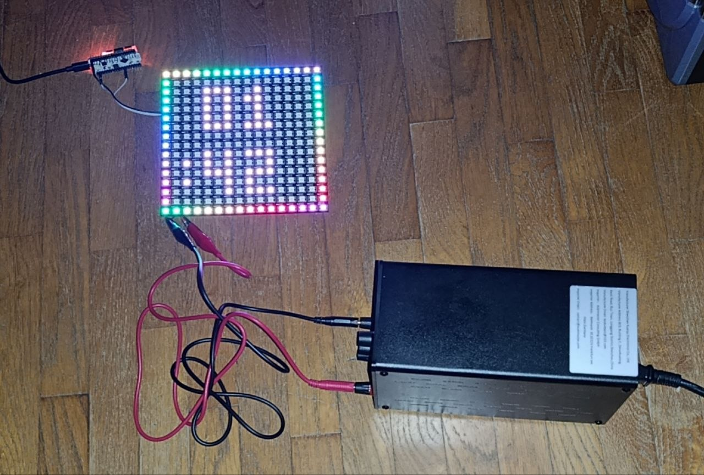

# iDotMatrix ESP32 Emulator

Experimental ESP32 firmware that emulates an **iDotMatrix 16x16** display and communicates directly with the iDotMatrix app over Bluetooth Low Energy.

<p align="center">
  
</p>

This project was created by reverse engineering the BLE traffic generated by the app, without access to an original iDotMatrix device. The goal is to reproduce as many app features as possible on a 16x16 WS2812B matrix driven by an ESP32, while documenting the observed protocol.

> Current status: **BUILD 62**, stable baseline verified on hardware.

## Hardware used

Current development setup:

- DollaTek ESP32 OLED 0.96" board with ESP32 and CP2102;
- 16x16 WS2812B matrix, 256 LEDs;
- matrix GPIO: **17**;
- status LED: **GPIO 25**;
- onboard 128x64 SSD1306 OLED:
  - SCL: GPIO 15
  - SDA: GPIO 4
  - RESET: GPIO 16
  - driven through U8g2 software I2C;
- buzzer: supported by the firmware but not installed;
- DS3231 RTC: optional support is implemented but not installed.

Maximum FastLED brightness is limited by `MAX_LED_BRIGHTNESS` (currently 50/255) to keep matrix current consumption under control.

## Implemented features

The firmware currently supports:

- BLE advertising recognized by the app;
- observed FA/AE services and characteristics;
- 16x16 device identification;
- date/time synchronization from the app;
- matrix power on/off;
- 180-degree rotation;
- brightness with NVS persistence;
- scheduled power saving;
- solid color;
- drawing/graffiti mode;
- 16x16 RAW RGB images;
- animated GIFs;
- text with glyphs, colors, background and effects;
- visual effects;
- clock and multiple clock styles;
- scoreboard;
- 10 audio visualizations: 5 LEVEL and 5 FFT;
- persistent alarms with associated media;
- persistent Programs/Schedules with GIF, text and PNG activities;
- 16x16 PNG decoder;
- optional diagnostic OLED;
- prominent OLED notification for unknown BLE commands.

Countdown and stopwatch are implemented locally, but app-side compatibility is not yet complete. See [TODO.md](TODO.md).

## Arduino dependencies

The source uses:

- ESP32 Arduino Core;
- FastLED;
- AnimatedGIF;
- U8g2 when `OLED_STATUS_ENABLED` is enabled;
- LittleFS and Preferences from the ESP32 core;
- RTClib only when `RTC_ENABLED` is set to 1.

The PNG decoder uses `miniz` from the ESP32 core/SDK and does not require an external PNG library.

## Flash partitioning

During development the firmware outgrew the application space available with the OTA partition layout. Since OTA is not used, the board is compiled with a partition layout providing about **2 MB for the application without OTA**.

If the firmware grows further, a layout with about 3 MB for the sketch can be used while still leaving enough room for LittleFS.

## Main configuration

The most important settings are grouped near the beginning of `src/IDotMatrix.ino`, including:

```cpp
#define FW_BUILD               62
#define DEBUG_SERIAL           1
#define OTA_ENABLED            0
#define MATRIX_PIN             17
#define STATUS_LED_PIN         25
#define MAX_LED_BRIGHTNESS     50
#define OLED_STATUS_ENABLED    1
#define RTC_ENABLED            0
#define ALARM_BUZZER_ENABLED   0
#define ALARM_SLOTS            10
#define SCHEDULE_MAX_ACTIVITIES 32
```

### Diagnostic OLED

The onboard OLED can be completely removed at compile time with:

```cpp
#define OLED_STATUS_ENABLED 0
```

BUILD 62 uses the OLED in **pure event-driven mode**. Because this board uses U8g2 software I2C, continuously transferring the full SSD1306 framebuffer caused visible stalls in the WS2812B animations in BUILD 60/61. B62 sends a new OLED framebuffer only when meaningful state changes occur.

The OLED reports build number, BLE connection, matrix power, current mode, brightness, Schedule/Alarm state, timer state and unknown commands. Unknown commands display their length and the first raw bytes, which is useful when the serial monitor cannot be used while the matrix is connected.

## Persistent storage

Two mechanisms are used:

- **Preferences / NVS** for small settings and metadata;
- **LittleFS** for alarm and Schedule media.

Brightness is also persisted so that reconnecting the app does not temporarily restore an incorrect default intensity.

## Repository layout

```text
.
|-- src/
|   `-- IDotMatrix.ino
|-- docs/
|   `-- captures/
|       |-- README.md
|       `-- *.txt
|-- README.md
|-- PROTOCOL.md
|-- TODO.md
|-- HISTORY.md
|-- LICENSE
`-- .gitignore
```

The `docs/captures/` directory contains selected experimental traces used as evidence during reverse engineering.

## Documentation

- [`PROTOCOL.md`](PROTOCOL.md) - detailed BLE protocol reverse engineering notes.
- [`TODO.md`](TODO.md) - feature status, known issues and future work.
- [`HISTORY.md`](HISTORY.md) - build history and major changes.
- [`docs/captures/`](docs/captures/) - significant experimental captures.

## Reverse-engineering notice

This is an independent interoperability/research project based on observing the behavior of the iDotMatrix app and the BLE packets it transmits. No original iDotMatrix firmware was copied or extracted, and the project was developed without an original hardware device.

The protocol documentation describes experimentally observed behavior. Some fields are still unknown or only partially understood; these are explicitly marked as such.

iDotMatrix and any related trademarks belong to their respective owners. This project is not affiliated with, sponsored by, or endorsed by the original manufacturer.

## License

This repository is released under the [MIT License](LICENSE).

Copyright (c) 2026 Piergiorgio Ghezzo.

## How you can help

Most known application features are implemented, but the reverse engineering is still active. **We are especially looking for owners of original iDotMatrix hardware** who can help verify the remaining protocol details.

Useful contributions include BLE captures from real hardware, unknown commands, tests with other models/app versions, PCB photographs, component identification, and corrections to the protocol documentation. See [TODO.md](TODO.md) for open questions and [CONTRIBUTING.md](CONTRIBUTING.md) for contribution guidelines.
