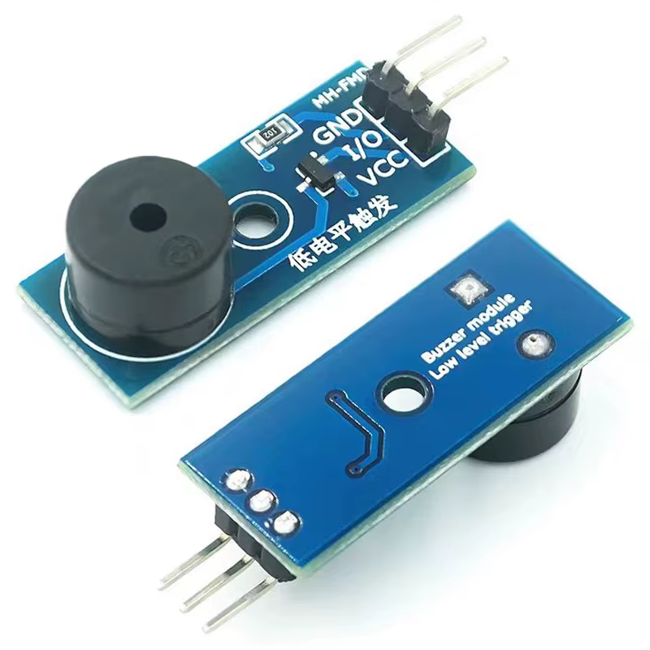
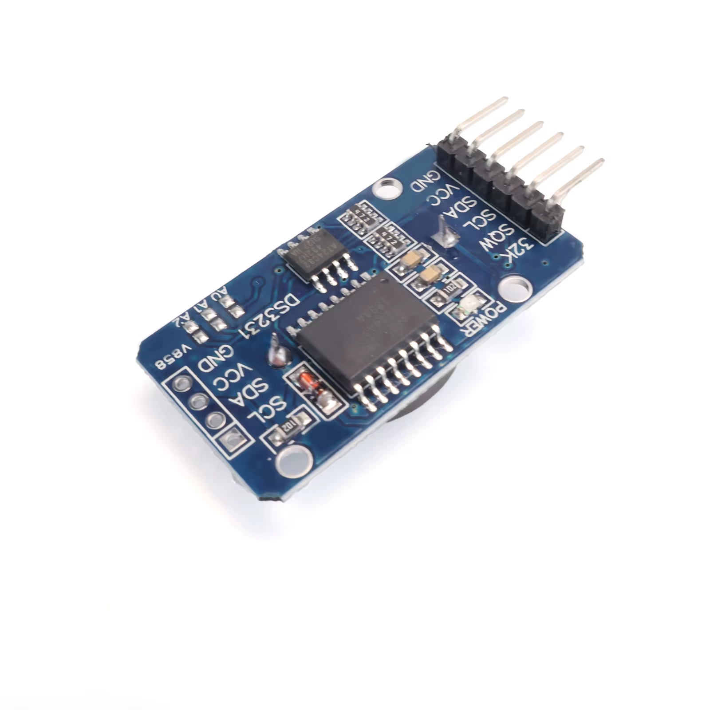
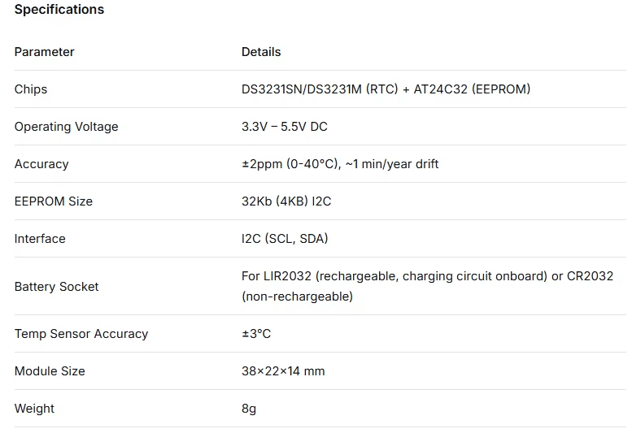
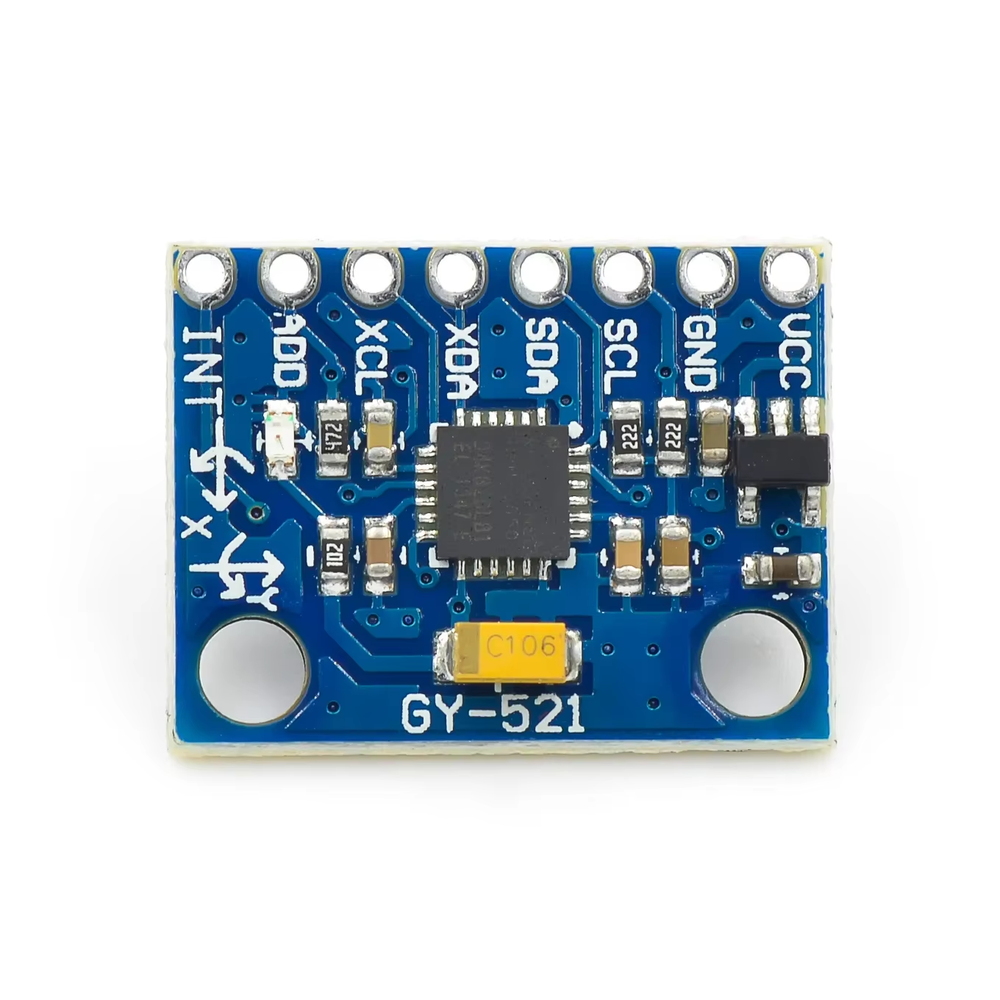

# Reference Hardware Modules

This page records the exact peripheral modules used or considered for the current stable line. It complements [`HARDWARE-SUPPORT.md`](HARDWARE-SUPPORT.md): a module appearing here is not automatically hardware-qualified. The status column is authoritative.

## Status summary

| Module | Project status | Reference use |
| --- | --- | --- |
| Three-wire passive low-level-trigger buzzer module | **Hardware-qualified** | ESP32-C3 GPIO3, 3.3 V, 2000 Hz |
| DS3231 + AT24C32 RTC/EEPROM module | **RTC path hardware-qualified** | ESP32-C3 shared I2C bus, DS3231 at `0x68` |
| External ICM-20689 accelerometer module | **Hardware-qualified** | ESP32-C3 automatic orientation |
| GY-521 module sold as MPU-6050 | **Implemented / awaiting physical qualification** | MPU-6050 orientation backend |

## Three-wire passive low-level-trigger buzzer

The physically qualified buzzer is the three-pin module marked `low level trigger`. The seller information supplied for this module states:

- passive buzzer element;
- S9012 transistor drive stage;
- 3.3 V to 5 V module supply;
- `VCC`, `GND`, and `I/O` interface;
- passive operation requires an external square wave, with a seller-recommended range of approximately 2 kHz to 5 kHz;
- PCB size approximately 33 x 13 mm;
- set weight approximately 6 g.

The project-qualified wiring uses **3.3 V**, `GND`, and ESP32-C3 **GPIO3**. The firmware drives a 2000 Hz LEDC square wave while sounding and holds GPIO3 **HIGH while silent**, because this module is low-level triggered and a constant LOW would leave its transistor conducting.

## DS3231 + AT24C32 RTC/EEPROM module

The qualified RTC board combines a DS3231-family RTC with an AT24C32 I2C EEPROM. The firmware currently uses **only the RTC portion**.

Vendor information supplied for the board states:

- RTC device: DS3231SN or DS3231M depending on supplied unit;
- DS3231 I2C address: `0x68`;
- onboard AT24C32 EEPROM, default address `0x57`, configurable through A0/A1/A2;
- operating supply listed as 3.3 V to 5.5 V;
- battery-backup socket;
- onboard temperature sensing as part of the RTC module;
- board dimensions approximately 38 x 22 x 14 mm;
- weight approximately 8 g.

The supplied seller material describes the AT24C32 as **32 Kbit (4 KB)** in its specification table, while one prose section calls it `32 KB`. The firmware does not use the EEPROM, so this discrepancy has no runtime effect on the emulator.

The supplied seller notes also distinguish rechargeable **LIR2032** operation from non-rechargeable **CR2032** use and explicitly warn not to apply main power with a CR2032 installed on the charging version of the board. Follow the electrical configuration of the actual module rather than assuming every DS3231 breakout has the same battery circuit.

Project qualification covers the DS3231 timekeeping path at `0x68`, battery-backed time retention, BLE time writeback, RTC retry/recovery and cold boot into Clock when no persisted Carousel has priority. The AT24C32 is not currently used by the firmware.

## GY-521 module sold as MPU-6050

The supplied seller documentation identifies this GY-521 board as an MPU-6050 module and lists:

- 3 V to 5 V module supply with onboard regulation;
- standard I2C communication;
- 16-bit converter/output data;
- gyroscope ranges of 250 / 500 / 1000 / 2000 deg/s;
- accelerometer ranges of 2 / 4 / 8 / 16 g;
- 2.54 mm header pitch.

The emulator already contains an `IDOTMATRIX_ACCEL_DRIVER_MPU6050` backend and uses only the accelerometer data required by the common orientation engine. That code path accepts MPU-family `WHO_AM_I` values `0x68` / `0x69` and is currently **implemented but not yet hardware-qualified** on this exact GY-521 board.

Do not identify a module solely from the GY-521 silkscreen or seller title. A visually similar module previously tested in this project was found to contain an **ICM-20689** instead and reported `WHO_AM_I=0x98`. The firmware therefore treats the runtime `WHO_AM_I` result as the authoritative chip identification.

If a DS3231 shares the same I2C bus, the motion sensor must use address `0x69`, because the DS3231 is fixed at `0x68`.
